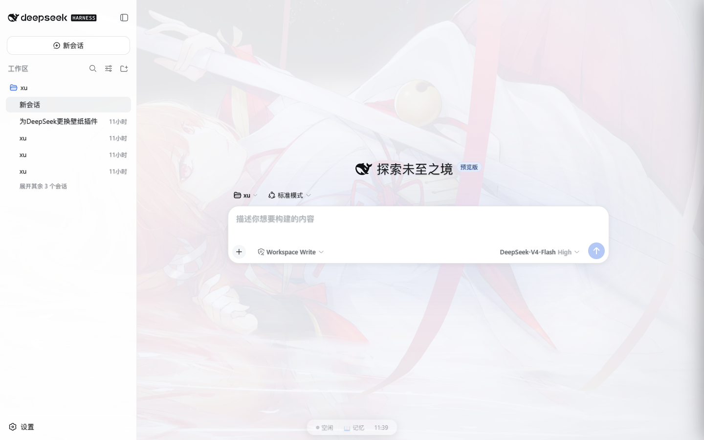
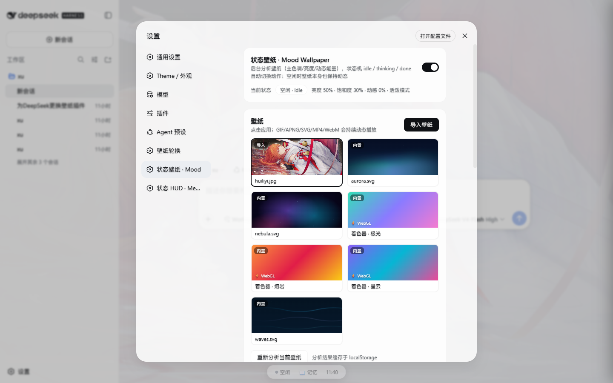

<div align="center">

# dsh-mood-wallpaper 🌌

**DSH（DeepSeek Harness）壁纸感知的动态壁纸引擎** —— 会"读懂"你的壁纸、随 agent 状态起舞的状态机 + 一串程序员向特效。

[](https://www.npmjs.com/package/dsh-mood-wallpaper)
[](LICENSE)
[](https://github.com/deepseek-ai/deepseek-harness)
[](package.json)

> 导入你自己的动态壁纸（GIF / MP4 / WebM / APNG / SVG），插件在**后台分析**它（取帧 → 主色调 / 亮度 / 饱和度 / 动态能量），状态机在「空闲 / 思考中 / 完成」间切换**自适应动效**——空闲时壁纸本身也保持动态，绝不死板。

</div>

---

## ✨ 特性一览

| 类别 | 能力 |
|---|---|
| 🖼️ **壁纸** | 导入动态壁纸（GIF/视频/APNG/SVG/静态，≤48MB）+ 3 张内置程序化动态壁纸 + 3 张 **WebGL 实时着色器壁纸**（极光/熔岩/星云，60fps 零依赖） |
| 🧠 **后台分析** | ImageDecoder 取帧 → 主色调 / 亮度 / 饱和度 / 动态能量 → **自适应风格**（色板染色 + lively/balanced/calm 动作模式） |
| 🎞️ **状态机** | 空闲（壁纸自身动画 + Ken Burns + 氛围光）→ 思考中（粒子汇聚 + 工具节点 + 光带 + 加速）→ 完成（光环绽放 + 粒子爆散） |
| ⌨️ **敲击能量场** | 敲键盘泛起能量火花，节奏随输入密度增强 |
| 🌧️ **会思考的代码雨** | 字符取自**真实对话 token**，思考时雨势暴涨 |
| 🧠 **思维投影** | 思考时粒子向核心汇聚，工具调用浮现图标节点（🔍📁⌨️🌐…按工具名分类） |
| 📺 **CRT 终端美学** | 扫描线 + 暗角 + 闪烁，一键复古终端 |
| 🌗 **昼夜循环** | 按本地时间自动染色（晨/昼/暮/夜） |
| 🖱️ **鼠标视差/尾迹** | 光层随鼠标微移 + 指针粒子流 |
| 🎹 **键盘乐章** | 敲击即五声音阶合成器（默认关） |
| 🎧 **环境音** | WebAudio 纯合成雨声 + 低音垫（零素材版权），思考时渐强、完成一声提示（默认关） |
| 🚨 **警报氛围** | LLM 失败/工具报错 → 红色警报脉冲；等待批准 → 琥珀待命光（自动恢复） |
| 📊 **token 速率驱动** | 思考时粒子密度随真实 token 流速自适应（最高 2×） |
| 🔋 **性能治理** | 页面不可见暂停全部动画/音频；`prefers-reduced-motion` 自动降级 |

## 🚀 安装（一条命令）

```bash
# npm 发布版（推荐）—— 一条命令装到任何人的 DSH
dsh plugin --profile web add dsh-mood-wallpaper

# 或本地源码调试（改源码后重启 dsh web 生效）
dsh plugin --profile web add <本仓库路径>
```

安装后**重启 `dsh web`** 生效。卸载：

```bash
dsh plugin --profile web remove dsh-mood-wallpaper
```

> DSH 是"一切皆插件"的架构；本插件是标准 `dsh.bundle` + `dsh.client` 双面插件，加载方式与官方 UI 包完全一致。

## 📸 截图

| 主界面（HUD 共存） | 设置页 |
|---|---|
|  |  |

## 🎮 使用

重启后打开 **设置 → 状态壁纸 · Mood**：

- **壁纸**：点击应用；「导入壁纸」上传 GIF/MP4/WebM/APNG/SVG/静态图；用户壁纸可删除
- **后台分析**：首次应用自动分析，展示「亮度/饱和度/动感/动作模式」，可手动重新分析
- **状态机与动效**：叠加风格（自动/极光/熔岩/深空/黑白）、动效强度、Ken Burns、完成动效
- **特效与氛围**：10 个独立开关（敲击能量场/思维投影/代码雨/CRT/昼夜/视差/尾迹/乐章/环境音/警报）
- **背景透明化**：背景/面板透明度滑杆

## 🏗️ 工作原理

```
        导入/内置动态壁纸（GIF·视频·SVG·静态图）
                    │
                    ▼
   后台分析（ImageDecoder 取帧 → 主色调/亮度/饱和度/动态能量）
                    │
                    ▼
   自适应风格（色板染色 + 动作模式 lively / balanced / calm）
                    │
                    ▼
   状态机  idle ──思考开始──▶ thinking ──思考结束──▶ done ──1.7s──▶ idle
            │                    │                     │
        壁纸自身动画         光带+粒子汇聚+工具节点      光环+闪光+粒子爆散
        +慢速KenBurns        +暗角脉冲（按亮度自适应）     （一次性，按壁纸色板）
        +氛围呼吸光
```

状态输入来自官方 `ConversationSnapshot`（partial / runningCalls / turnTimings / openState / nodes / pending），订阅走 `ctx.sessions` 官方服务。

## 📦 结构

```
dsh-mood-wallpaper/
├── package.json     # dsh.bundle + dsh.client 声明
├── cordis.patch.yml # bundle 组合补丁（插入 mood-wallpaper 入口）
├── assets/          # 内置程序化动态壁纸（aurora / nebula / waves，SMIL SVG）
├── docs/            # 截图
└── lib/
    ├── index.js     # host 半边：壁纸资产托管路由（list / asset / import / delete / config）
    └── client.js    # 浏览器半边：后台分析 + 自适应状态机 + WebGL 着色器 + 粒子引擎 + 特效 + 设置页
```

## 🔌 兼容性

- 纯原生 DSH 插件，无注入、不改安装包
- 壁纸层独立 `<div>`（`z-index:-1`）+ 私有 `<style>`（类前缀 `dswm-`），不触碰其他插件 DOM
- 主题覆盖走 `ctx.theme.overrideTokens` 分层合成，与壁纸轮换/换肤插件共存
- 与 [dsh-ui-hud](https://github.com/wzyn20051216/dsh-ui-hud)（状态 HUD + 记忆中心）配合使用效果更佳

## 🧪 冒烟测试

- API：list / asset（MIME、路径穿越拦截）/ import↔delete / config 全部通过
- 浏览器 E2E（agent-browser + mock LLM）：状态机 `idle → thinking → done → idle` 复验通过；滑杆/开关/持久化/WebGL 全链路通过
- 一条命令安装（全新 profile + tarball）验证通过

## 🤝 贡献

欢迎 PR！开发提示：改 `lib/` 后重启 `dsh web` 生效；`node --check lib/client.js` 做语法校验。

## 📄 License

[MIT](LICENSE)
